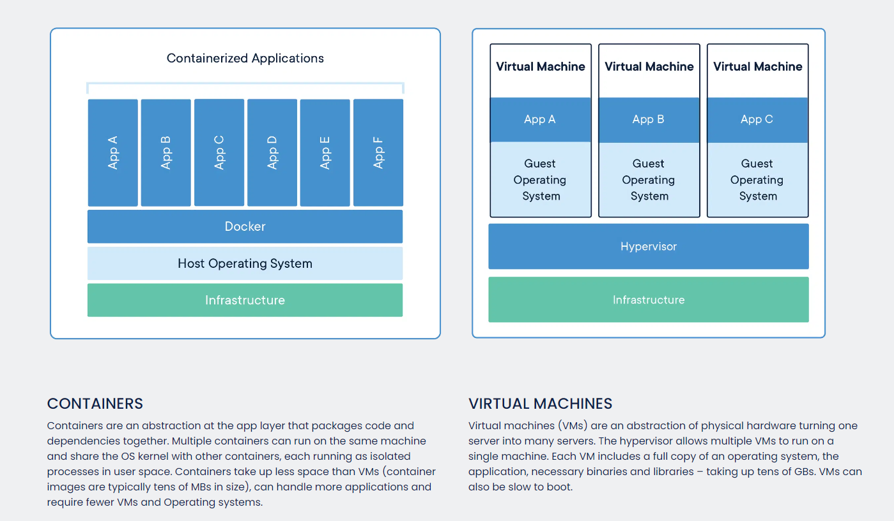

# aws-sagemaker-training

Reference: https://github.com/aws/sagemaker-training-toolkit

Amazon SageMaker is a fully managed service for data science and machine learning (ML) workflows. You can use Amazon SageMaker to simplify the process of building, training, and deploying ML models.

To train a model, you can include your **training script** and **dependencies** in a **Docker container** that runs your training code. A container provides an effectively isolated environment, ensuring a consistent runtime and reliable training process.

The SageMaker Training Toolkit can be easily added to any Docker container, making it compatible with SageMaker for training models. If you use a prebuilt SageMaker Docker image for training, this library may already be included.

For more information, see the Amazon SageMaker Developer Guide sections on using Docker containers for training.


## Installation

To install this library in your Docker image, add the following line to your Dockerfile:
```dockerfile
RUN pip3 install sagemaker-training
```

## Usage

The following are brief how-to guides. For complete, working examples of custom training containers built with the SageMaker Training Toolkit, please see the example notebooks.

### Create a Docker image and train a model

1. Write a training script (eg. train.py).

2. Define a container with a Dockerfile that includes the training script and any dependencies.

The training script must be located in the /opt/ml/code directory. The environment variable SAGEMAKER_PROGRAM defines which file inside the /opt/ml/code directory to use as the training entry point. When training starts, the interpreter executes the entry point defined by SAGEMAKER_PROGRAM. Python and shell scripts are both supported.

```dockerfile
FROM yourbaseimage:tag

# install the SageMaker Training Toolkit 
RUN pip3 install sagemaker-training

# copy the training script inside the container
COPY train.py /opt/ml/code/train.py

# define train.py as the script entry point
ENV SAGEMAKER_PROGRAM train.py
```

3. Build and tag the Docker image.
```
docker build -t custom-training-container .
```

4. Use the Docker image to start a training job using the SageMaker Python SDK.

```python
from sagemaker.estimator import Estimator
estimator = Estimator(image_name="custom-training-container",
                      role="SageMakerRole",
                      train_instance_count=1,
                      train_instance_type="local")

estimator.fit()
```
To train a model using the image on SageMaker, [push the image to ECR](https://docs.aws.amazon.com/AmazonECR/latest/userguide/docker-push-ecr-image.html) and start a SageMaker training job with the image URI.


## Docker




## Custom Python Environment Through Lifecycle Configurations

**Lifecycle Configurations** runs the script before the sagemaker notebook is initialized. This script can be used to establish the custom conda environment. 

```bash
#!/bin/bash

set -e

# OVERVIEW
# This script installs a custom, persistent installation of conda on the Notebook Instance's EBS volume, and ensures
# that these custom environments are available as kernels in Jupyter.
# 
# The on-create script downloads and installs a custom conda installation to the EBS volume via Miniconda. Any relevant
# packages can be installed here.
#   1. ipykernel is installed to ensure that the custom environment can be used as a Jupyter kernel   
#   2. Ensure the Notebook Instance has internet connectivity to download the Miniconda installer

sudo -u ec2-user -i <<'EOF'

unset SUDO_UID

# Install a separate conda installation via Miniconda
WORKING_DIR=/home/ec2-user/SageMaker/custom-miniconda
mkdir -p "$WORKING_DIR"

wget https://repo.anaconda.com/miniconda/Miniconda3-4.6.14-Linux-x86_64.sh -O "$WORKING_DIR/miniconda.sh"
bash "$WORKING_DIR/miniconda.sh" -b -u -p "$WORKING_DIR/miniconda" 
rm -rf "$WORKING_DIR/miniconda.sh"

# Create a custom conda environment
source "$WORKING_DIR/miniconda/bin/activate"
KERNEL_NAME="py38_cuda"
PYTHON="3.8.10"
conda create --yes --name "$KERNEL_NAME" -c conda-forge cudatoolkit cudnn python="$PYTHON"
conda activate "$KERNEL_NAME"
pip install --quiet ipykernel

# Customize these lines as necessary to install the required packages
conda install --yes numpy
pip install --quiet boto3

EOF

```

## Automate SageMaker Notebooks Through Lambda and Lifecycle Configurations

This script can also be used to auto run the notebook instance. The default time limit for lifecycle configuration script is 5 minutes. To overcome this limit for notebook training, nohup function is used.

 It assumes that the notebook called schedule_script.ipynb is in the home location, and that gets triggered. Change the variable NOTEBOOK_FILE to point to your notebook. The /home/ec2-user/SageMaker part should ideally be common in the path.
 
Reference: https://medium.com/analytics-vidhya/a-guide-to-schedule-sagemaker-notebooks-a7a09eb641f6
 
 ```bash
 set -e
ENVIRONMENT=python3
NOTEBOOK_FILE="/home/ec2-user/SageMaker/schedule_script.ipynb"
AUTO_STOP_FILE="/home/ec2-user/SageMaker/auto-stop.py"
 
echo "Activating conda env"
source /home/ec2-user/anaconda3/bin/activate "$ENVIRONMENT"
echo "Starting notebook"
nohup jupyter nbconvert  --to notebook --inplace --ExecutePreprocessor.timeout=600 --ExecutePreprocessor.kernel_name=python3 --execute "$NOTEBOOK_FILE" &
echo "Decativating conda env"
source /home/ec2-user/anaconda3/bin/deactivate
# PARAMETERS
IDLE_TIME=600 # 10minute
echo "Fetching the autostop script"
wget https://raw.githubusercontent.com/aws-samples/amazon-sagemaker-notebook-instance-lifecycle-config-samples/master/scripts/auto-stop-idle/autostop.py
echo "Starting the SageMaker autostop script in cron"
(crontab -l 2>/dev/null; echo "*/1 * * * * /usr/bin/python $PWD/autostop.py --time $IDLE_TIME --ignore-connections") | crontab -
 ```
